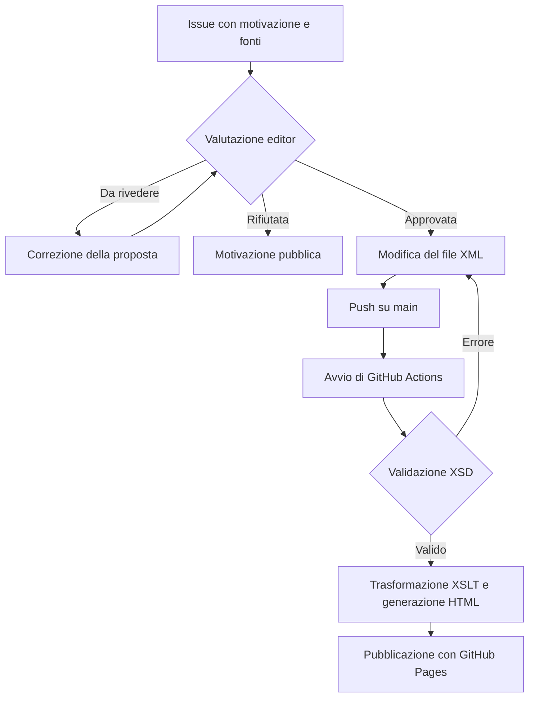

\begin{center}
\includegraphics[width=2.7cm]{./logo/minerva.jpg}
\end{center}

# Tesauro bilingue sulla governance dell'intelligenza artificiale

Progettazione di un flusso editoriale digitale riproducibile

## Introduzione

Il progetto realizza un prototipo di tesauro bilingue dedicato alla governance dell'intelligenza artificiale. Ogni voce contiene un termine inglese, la traduzione italiana, una definizione in inglese, le relazioni con altri termini e almeno una fonte.

Il contenuto è conservato in XML, la struttura è verificata mediante uno schema XSD e la pagina HTML è generata con una trasformazione XSLT.

Il progetto comprende inoltre un flusso editoriale. L'aggiunta di un dato viene proposta tramite un'Issue pubblica e deve contenere una motivazione e delle fonti. Dopo la valutazione del gestore della repository, l'editor inserisce la proposta approvata nel file XML e fa il push. Da quel momento GitHub Actions valida i dati, genera l'HTML e pubblica il sito [@processoEditoriale; @workflow].

\clearpage

## Ideazione

### Tema

Il tema è la terminologia relativa alla governance dell'intelligenza artificiale.

Il tesauro è un vocabolario organizzato che collega i termini attraverso relazioni semantiche, ogni voce contiene:

- `BT` (*broader term*), per un termine più generale;
- `NT` (*narrower term*), per un termine più specifico;
- `RT` (*related term*), per un termine associato;
- `UF` (*use for*), per una forma alternativa.

L'ID è un identificatore della voce e non viene richiesto a chi invia una proposta. In caso di approvazione, è l'editor ad assegnare il numero successivo.

### Destinatari

Ho sviluppato due personas a cui il progetto fa riferimento:

**Giulia, ricercatrice in ambito giuridico.** Deve controllare il significato di un termine inglese incontrato nell'AI Act.

**Marco, collaboratore editoriale.** Nota che manca un termine. Seleziona il pulsante "Proponi una modifica", compila l'Issue con dettagli, motivazione e fonti e attende una decisione sulla modifica.

### Requisiti di accettazione

I requisiti sono stati ricavati dalla consegna d'esame [@consegna2026].

| Requisito | Stato |
| --- | --- |
| Rappresentare il tesauro | Raggiunto con XML |
| Controllare la struttura | Raggiunto con XSD |
| Pubblicare sul Web | Raggiunto con XSLT, Actions e Pages |
| Raccogliere proposte motivate | Raggiunto con Issue |
| Conservare la storia | Raggiunto tramite GitHub |
| Offrire una vista filtrabile | Raggiunto con JavaScript |

\clearpage

### Canali di distribuzione

Il canale principale è il Web. La pagina è pubblicata con GitHub Pages all'indirizzo <https://simone-impelliccieri.github.io/Editoria-Progetto/>. La repository all'indirizzo <https://github.com/Simone-impelliccieri/Editoria-Progetto> e contiene i dati sorgente, lo schema, la trasformazione e gli script.

I formati impiegati sono:

- XML per il contenuto ;
- XSD per lo schema di XML;
- XSLT per la trasformazione;
- HTML, CSS e JavaScript per la parte del Web;
- Markdown per la relazione, convertibile successivamente in PDF con Pandoc.

L'identità visiva è semplice e leggibile. Ho scelto un tono formale e comprensibile, adatto a contenuti normativi e tecnici.

## Processo di Produzione

### Acquisizione dei contenuti

Il punto di partenza è il foglio `tesauro.xlsx`. I dati selezionati sono stati riportati nel documento XML.

### Gestione documentale

#### Scelta del formato sorgente

Ho scelto XML perché  descrive bene dati gerarchici e permette di ripetere elementi come relazioni e fonti. È  anche facilmente estensibile e indipendente dalla piattaforma [@formatiXML]. JSON sarebbe una possibile alternativa, ma XML si integra direttamente con XSD e XSLT.

Esempio di elemento in tesauro:

```xml
<voce id="17">
  <termineEN>Harmonised standard</termineEN>
  <traduzioneIT>Norma armonizzata</traduzioneIT>
  <definizioneEN>A European standard as defined in Regulation (EU) No 1025/2012 on European standardisation.</definizioneEN>
  <bt>Standards and conformity</bt>
  <rt>Standardisation organisation</rt>
  <uf>HS</uf>
  <fonte>AI Act, Art. 3(29)</fonte>
</voce>
```

\clearpage

#### Flusso editoriale

Il processo di proposta e revisione distingue due ruoli:

- l'**utente che propone** segnala una nuova voce e fornisce motivazione e fonti;
- l'**utente che gestisce la repository(editor)** verifica la completezza, valuta le fonti, assegna l'ID e controlla la modifica.

Il flusso è il seguente:

1. l'utente che propone apre un'Issue pubblica attraverso il modulo "Proposta di modifica".
2. L'editor controlla che termine, dettagli, motivazione e fonti siano sufficienti.
3. L'editor risponde pubblicamente con uno dei tre esiti: **approvata**, **da rivedere** oppure **rifiutata**, spiegandone il motivo.
4. Se sono necessarie correzioni, l'utente che propone corregge l'Issue e la valutazione viene ripetuta.
5. Dopo una proposta approvata  l'editor modifica l'XML ed esegue push con i dati aggiornati.
6. In seguito al comando push GitHub Actions valida i dati, genera l'HTML e pubblica il sito. L'Issue può essere chiusa.

```{=latex}
\begin{center}
\begin{minipage}{0.82\linewidth}
```



```{=latex}
\end{minipage}
\end{center}
```

\clearpage

#### Versionamento e storico

Il ramo `main` contiene la versione corrente del progetto. Ogni aggiornamento approvato viene registrato in un commit che permette di sapere quali file sono stati modificati. Nel messaggio del commit può essere indicato anche il numero dell'Issue corrispondente.

### Tecnologie adottate

| Tecnologia | Utilizzo |
| --- | --- |
| XML | Archivio delle voci |
| XSD | Schema del tesauro |
| XSLT | Trasformazione XML-HTML |
| Python | Validazione e avvio della trasformazione |
| HTML e CSS | Pagina pubblica |
| JavaScript | Filtri |
| Git e GitHub | Versionamento e Issue |
| GitHub Actions e Pages | Automazione e distribuzione web |
| Markdown e Pandoc | Relazione |

### Esecuzione del flusso

Tutti i materiali necessari per l'esecuzione del flusso sono disponibili nella repository del progetto. Per eseguire la generazione basta eseguire i comandi:

```text
python -m pip install -r requirements.txt
python scripts/genera_html.py
```

Lo script esegue in ordine:

1. lettura di `data/tesauro.xml`;
2. lettura di `schema/tesauro.xsd`;
3. validazione del documento XML;
4. applicazione di `site/tesauro.xsl`;
5. scrittura di `site/index.html`.

Nella repository il file `.github/workflows/pubblica-sito.yml` ripete lo stesso procedimento a ogni push su `main`: scarica i file, prepara Python, installa i requirements, genera la pagina(`site`) e la aggiorna tramite GitHub Pages. [@githubPages]

### Utilizzo di intelligenza artificiale generativa

Ho utilizzato strumenti di intelligenza artificiale generativa come supporto durante lo sviluppo del progetto. In particolare, li ho usati per ricevere idee generali su come organizzare il lavoro, per velocizzare alcuni passaggi, come la conversione iniziale dei dati dal file Excel al formato XML, e come aiuto nella realizzazione della parte grafica del sito.

\clearpage

## Valutazione dei risultati raggiunti

### Valutazione del flusso di produzione

Il progetto soddisfa le parti principali della consegna. Il file XML contiene 14 voci bilingui e rappresenta anche relazioni e fonti. Lo schema XSD viene applicato prima della trasformazione. L'HTML è prodotto correttamente. Il sito permette  di applicare i tre filtri previsti.

### Limiti emersi

Il progetto presenta alcuni limiti :

- XSD impone un ID , ma non controlla da solo l'unicità né calcola il numero successivo;
- La grafica è essenziale e semplice;

## Conclusioni

Gli obbiettivi delle personas sviluppate precedentemente risultano raggiunti. Il lettore può consultare termini, traduzioni e definizioni o può proporre una nuova voce attraverso un modulo. L'editor controlla l'approvazione delle modifiche.

## Bibliografia

::: {#refs}
:::
